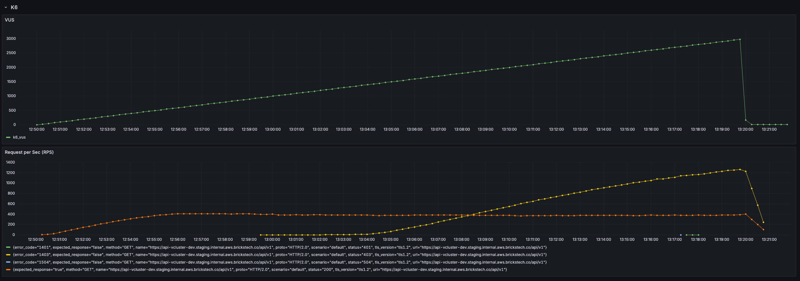
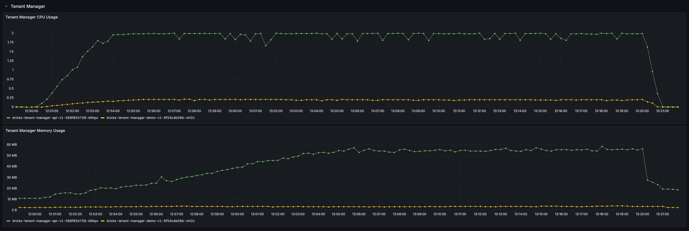
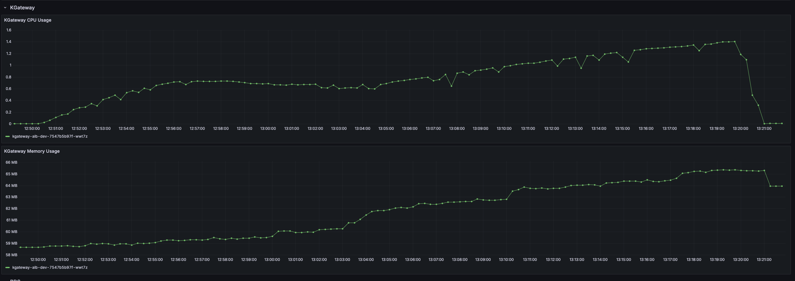
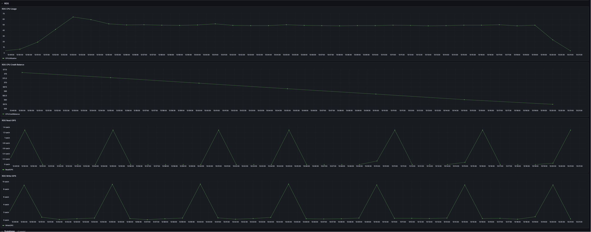

# Tenant Manager Breakpoint Testing

## Revision Information
| Version | Date | Amendment | Author |
| ------- | ---- | --------- | ------ |
| 0.1.0 | 12 March 2026 | Initial Breakpoint Testing Plan | Tapaneeya Odmung |
| 0.1.1 | 12 March 2026 | Fix Markdown Syntax | Tapaneeya Odmung |
| 0.2.0 | 12 March 2026 | Adding recovery time check | Tapaneeya Odmung |
| 0.3.0 | 14 March 2026 | Adding test result | Tapaneeya Odmung |
| 0.4.0 | 16 March 2026 | Remove latency from test | Tapaneeya Odmung |
| 0.5.0 | 19 March 2026 | Fix test result | Tapaneeya Odmung |

## BP01 - Tenant Manager Maximum Concurrent Request Limit
Description: Finding maximum number of concurrent request of tenant manager before system breakdown.  
Endpoint: https://api-vcluster-dev.staging.internal.aws.brickstech.co/api/v1  
Type: GET  
Duration: 30 minutes 30 seconds 
Steps:

    1. Load Authorization Token
    2. Load Tenant ID
    3. Load Tenant Provider
    4. Setting Header
        4.1. Authorization as Bearer ${Authorization Token}
        4.2. X-Tenant-ID as ${Tenant ID}
        4.3. X-Tenant-Provider as ${Tenant Provider}
    5. Set concurrent request as 10 requests
    6. Send HTTP GET request to the Endpoint
    7. Check if requests HTTP response does not within range of 200 - 299  (inclusive)
        7.1. If Success Rate = 100%, increase load.
        7.2. If Success Rate < 95% for more than 30 seconds, mark this as the Breakpoint and begin the "Scale Down" phase.
    8. Mark a failure timestamp
    9. Set concurrent request as 1 requests
    10. Send HTTP GET request to the Endpoint
    11. Check if the request taking less than 1 seconds or HTTP respones is in range of 200 - 299 (inclusive)
        11.1. If Success, mark a recovery timestamp and end testing.
        11.2. If Not Success, wait 5 seconds and repeat step 10.

Expected Outcome:

    - Maximum concurrent request before system breakdown. 
    - CPU and Memory usage of a system.
    - Recovery time after system breakdown.

## Results
1) K6  
  
2) Tenant Manager  
  
3) KGateway  

4) RDS  
  

## Analysis
K6 results show that when virtual users hit 407 vus/s the request per seconds (RPS) went flat line which notate that
this is the maximum RPS that we can achieve. But after when investigate further, from the tenant manager graph, 
we can see that the max cpu usages have reached the specific amount which is 2 vCPU units at around 311 vus. 
But because of each virtual testing unit always wait for respond from the server, when the time limit of request 
is reached via the fix amount set on server side which we can see from rising number of 403 HTTP Request Timeout which
is delayed at 950 vus. Interestingly there is a period of time that there is a short burst of 401 HTTP Request Unauthorize came out which 
signify on a problem on token authorization unit which is needed to investigate further.  
  
  
On the KGateway side, we can see a linear relation between the time where the cpu rising but after that became flat line until 1450 vus. 
This show that when the request input and the request out is the same. The key reason of this balance out became clear that when the flatline occur is that 
the request start to get 403 HTTP Request Timeout that mean this linearity came from the balance out of the rate of growth and the request time out. 
and after that the surge of another linear relation can be infered as accumulative timeout from previous request and the server cannot keep up and resolve the request in time.  
  
  
Lastly, RDS side is not surprising after cpu throughput is reached the RDS access is flatlined because there is no request got access more than cpu throughput. 
Interestingly, these write iops show that the amount of operation is less than the repeated occurance of peak which can be infered as a database backup so there is a lot of head room for number amount of vus that will causing 
a database problem.  

## Conclusion
From these results, the maximum number of throughput of maximum user should not exceed 311 vus/s. While system is not breaking down because of Kubernetes safety but we can choose rate limit to 300 vus/s because we already at 
maximum capacity of cpu usage. The results also show that at current amount of user the limitation of how many users can access conccurently is limited to 
Tenant Manager to further increase concurrent users load by scaling or optimize Tenant Manager might be the great fit for this current testing system.

## Action plan
1. For stress testing, the amount of max vus should be 350 vus.
2. For peak testing, the peak amount should be 300 vus.
3. For load testing, the amount of max vus should be at 90 vus
4. For endurance testing, the amount of max vus should be at 250.
5. Investigate short burst of 401 HTTP Request Unauthorize request.
